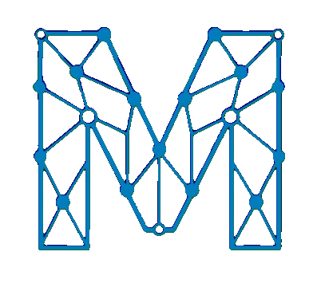
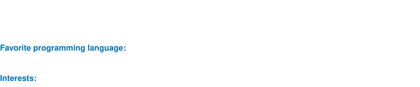

<!-- Generated by tools/theme.py from tools/README.template.md. Edit those. -->
<!-- Intro -->

  

---

<!-- About me -->

  

---

<!-- Support -->

  

---

<!-- Tech -->

  
  
  
  
  
  
  
    
  
  
  
  
  
  
  
  
  
  
  
  
  
  
    
  
  
  
  
  
  
    
  
  
  

---

<!-- Active -->

  
  

  
  
  
  

---

<!-- Stats -->

<!-- Both cards render at 400x290: top-langs compact with 16 langs, stats with 6 rows at line_height=35.
     More languages than 16 adds a row to top-langs and breaks the equal height. -->

  
  

